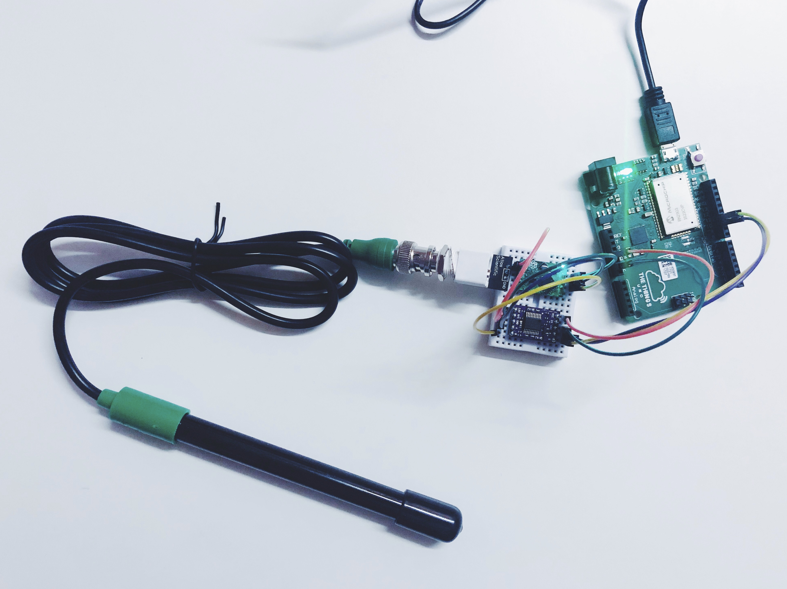

# Water quality sensors

Measuring water quality using a conductivity sensor and a The Things Uno.



See also:
* [Bluetooth Arduino code](https://github.com/sighmon/ble_nano_v2_sensors)
* [iOS app code](https://github.com/sighmon/WaterQualitySensorsiOS)

## Hardware

* [Atlas Scientific Conductivity K 1.0 sensor kit](https://www.atlas-scientific.com/product_pages/kits/ec_k1_0_kit.html)
* [The Things Uno](https://www.thethingsnetwork.org/docs/devices/uno/)
* [RedBear BLE Nano v2](https://redbear.cc/product/ble-nano-2.html)

## Wiring

I’ve drawn up a [Fritzing wiring diagram](water-quality-sensors-wiring-diagram.fzz), but didn’t have the power isolator layout… I’ll update that soon.

Atlas sensor pin | Power isolator pin | BLE Nano
--- | --- | ---
VCC | 3.9V | VIN
GND | GND | GND
TX | A (In) | RX
RX | B (In) | -

Power isolator pin | Arduino The Things Uno (Leonardo) pin
--- | ---
VCC | 5V
GND | GND
A (Out) | 10 (Digital)
B (Out) | 11 (Digital)

## Software

The Things Uno has a LoRaWAN chip that can send signals ~15km to [The Things Network](https://www.thethingsnetwork.org), which is great for remote sensors.

I'm using a `secrets.h` file to store the API keys. So to run this code on your Arduino, create a secrets file with the following code:

```c
// secrets.h
#define APPEUI "YOUR_APP_EUI"
#define APPKEY "YOUR_APP_KEY"
```

To get an APPEUI and APPKEY, follow The Things Network setup guide:
https://www.thethingsnetwork.org/docs/devices/uno/quick-start.html#create-an-account

## Output

Once running, you should see this debug output to your serial monitor, where:

* EC = conductivity
* TDS = total dissolved solids
* SAL = salinity
* GRAV = specific gravity (sea water only)

```bash
-- STATUS
EUI: <EUI>
Battery: 3253
AppEUI: <APP_EUI>
DevEUI: <DEV_EUI>
Data Rate: 3
RX Delay 1: 1000
RX Delay 2: 2000

-- SENSOR READING
EC:0.00
TDS:0
SAL:0.00
GRAV:1.000

-- BYTE ARRAY TO SEND
30 2E 30 30 2C 30 2C 30 2E 30 30 2C 31 2E 30 30 30 00 

Sending: mac tx uncnf 1 302E30302C302C302E30302C312E30303000
```

## Sample readings

Here are some sample readings from Port Willunga, South Australia, 2nd Jan 2019.

```bash
// Fresh water from the tap
EC:601.2
TDS:325
SAL:0.29
GRAV:1.000

// Beach water
EC:51631
TDS:27881
SAL:33.94
GRAV:1.026
```

And one from the Adelaide CBD, South Australia, 2nd Jan 2019.

```bash
// Fresh water from the tap at a new apartment block
EC:600.4
TDS:324
SAL:0.29
GRAV:1.000

// Neverfail spring water
EC:211.6
TDS:114
SAL:0.10
GRAV:1.000
```

## Blog posts

I've been blogging about my experience setting these sensors up over at: [sighmon.com/says](https://sighmon.com/says)

The story begins here: [sighmon.com/says/water-quality-monitor/](https://sighmon.com/says/water-quality-monitor/)

## License

The MIT License

Copyright (c) 2019 Simon Loffler

Permission is hereby granted, free of charge, to any person obtaining a copy
of this software and associated documentation files (the "Software"), to deal
in the Software without restriction, including without limitation the rights
to use, copy, modify, merge, publish, distribute, sublicense, and/or sell
copies of the Software, and to permit persons to whom the Software is
furnished to do so, subject to the following conditions:

The above copyright notice and this permission notice shall be included in
all copies or substantial portions of the Software.

THE SOFTWARE IS PROVIDED "AS IS", WITHOUT WARRANTY OF ANY KIND, EXPRESS OR
IMPLIED, INCLUDING BUT NOT LIMITED TO THE WARRANTIES OF MERCHANTABILITY,
FITNESS FOR A PARTICULAR PURPOSE AND NONINFRINGEMENT. IN NO EVENT SHALL THE
AUTHORS OR COPYRIGHT HOLDERS BE LIABLE FOR ANY CLAIM, DAMAGES OR OTHER
LIABILITY, WHETHER IN AN ACTION OF CONTRACT, TORT OR OTHERWISE, ARISING FROM,
OUT OF OR IN CONNECTION WITH THE SOFTWARE OR THE USE OR OTHER DEALINGS IN
THE SOFTWARE.
